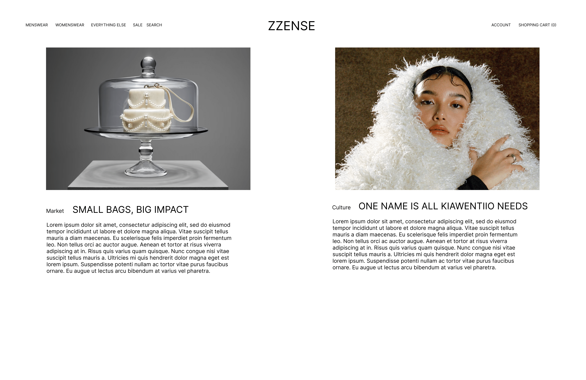
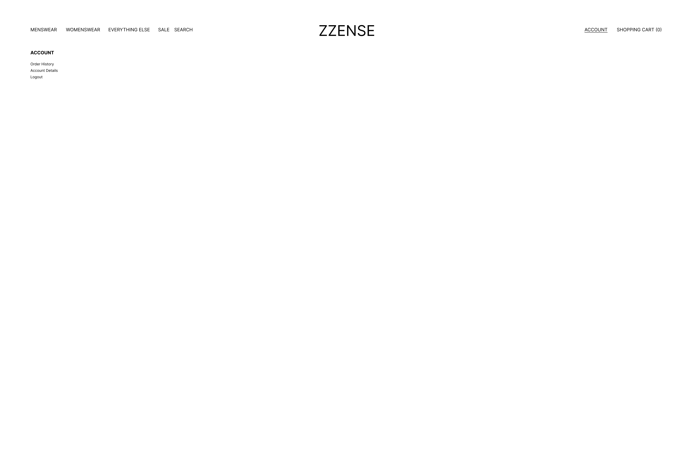
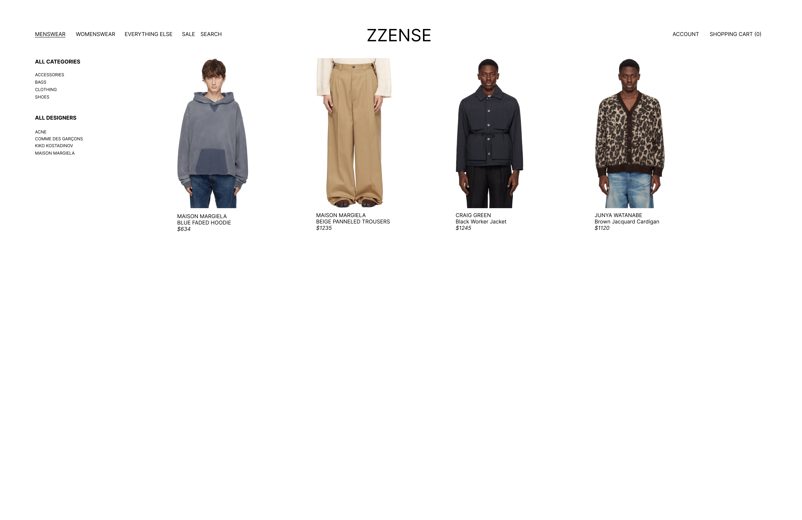
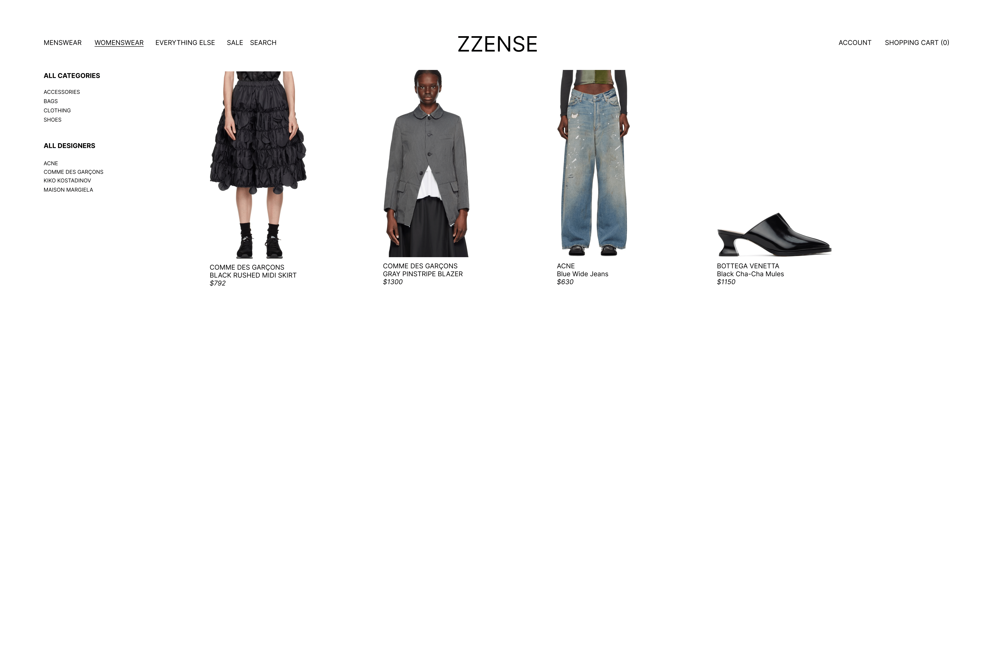

# ZZENSE - An SSENSE (CSCI-UA.467 - Final Project)
This is the README file for my SSENSE clone final project for CSCI-UA 467. Below
is the documentation for the final project proposal for *CSCI-UA 467: 
Applied Internet Technology*.

# ZZENSE Clone
## Overview

[SSENSE](https://www.ssense.com) is a high-fashion e-commerce website originating from Montreal. As someone
who has a passion for fashion (lol - bars), I use SSENSE a lot when trying to find
clothes to buy whenever I am in my phase of buying clothes (revamp closet, recycle
clothes, etc.) - this only applies to when they have their \textit{Private Sale}.
Buying clothes for retail through SSENSE is just non-feasible lol.

SSENSE uses WooCommerce to deploy their stock to the internet. I'll be building 
my clone with a MERN Stack approach, MongoDB (Mongoose), ExpressJS, ReactJS, and
NodeJS. Building this clone is my way of showcasing the skills I have learned this
semester in CSCI-UA.467.

My website, ZZENSE, is an SSENSE-clone, with a lot less data, but the same
functionality of that SSENSE provides - shopping, adding to a cart, and logging
into an account.

## Front-End Framework
As mentioned in the overview of this project, I'll be building the front-end 
with React as the front-end framework. With prior React Experience as well as 
building another project in React this semester too, I feel like building more
projects with React will help me fine-tune my skills with React. I also plan to
configure TailwindCSS as my CSS framework as I also have experience using
tailwind to style front-end websites.

## Data Schema
SSENSE uses a database to hold all of their stock from different brands. I don't
have any information on what type of database they use, but I will be creating
the database for this project with MongoDB - specifically Mongoose.

My goal is to store user data in the database, as well as hard-coded items from
to display onto the website.


An Example User:
```javascript
{
    user: // a reference to a user objext
    password: // a user's password which will be used for authentication
    shoppingCart: [{
        productID: ,
        quantity:
    }]  // using an array that will render the list on screen if users add 
        // or delete products from their shopping cart
}
```

An Example Clothing Piece Item:
```javascript
{
    brand: ,// brand/designer name
    type:   ,// type of clothing item
    gender: ,// to decide mens or womenswear - to be displayed based on gender
    price:  ,// price of item
    sku:    // id for the item {normally would be provided by the retailer}
}
```

[Sample DB Schema code](./server/db.mjs)

## Website Layout
### Wireframe
The wireframe for this project was built in Figma. Super simple prototype of
the website schema can be seen below:


This is the landing page for the website



This is the account page for the website



This is the menswear page for the website



And this is this womenswear page for the website



The overall layout of the SSENSE shopping pages are very simple, with four columns
to the displaying products all the way down the page. The navbar located at the
top of the page is also very simple, with the links to other pages as well as
a simple underline to inform users which page they are currently on.

I don't plan on adding anything else to the design of the website as the main
goal of this project is to develop a full-stack website (clone) with fully working
client-server communication with working database integration.

## Concluding
This about wraps up the beginning of this project. Further edits will be made to
the application as well as updates in the README.md file regarding what has been
updated as well as comments for each commit that will detail what has been added.

Thank you for reading this and I hope y'all enjoy my project!
